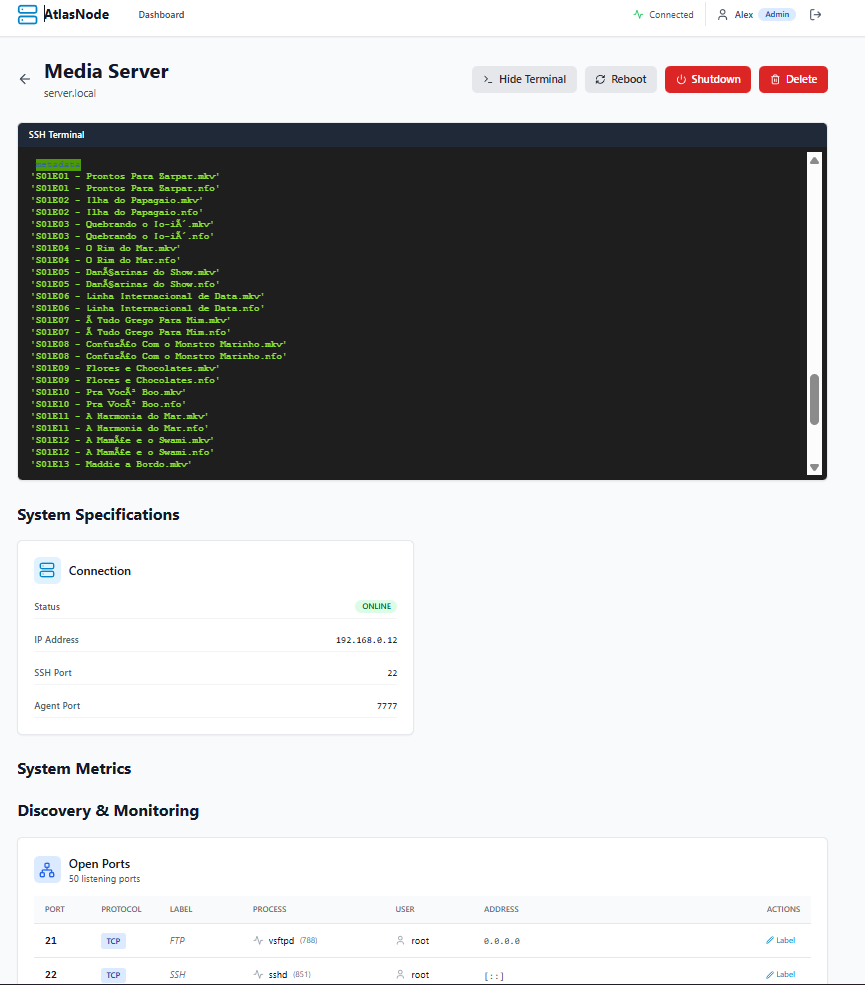
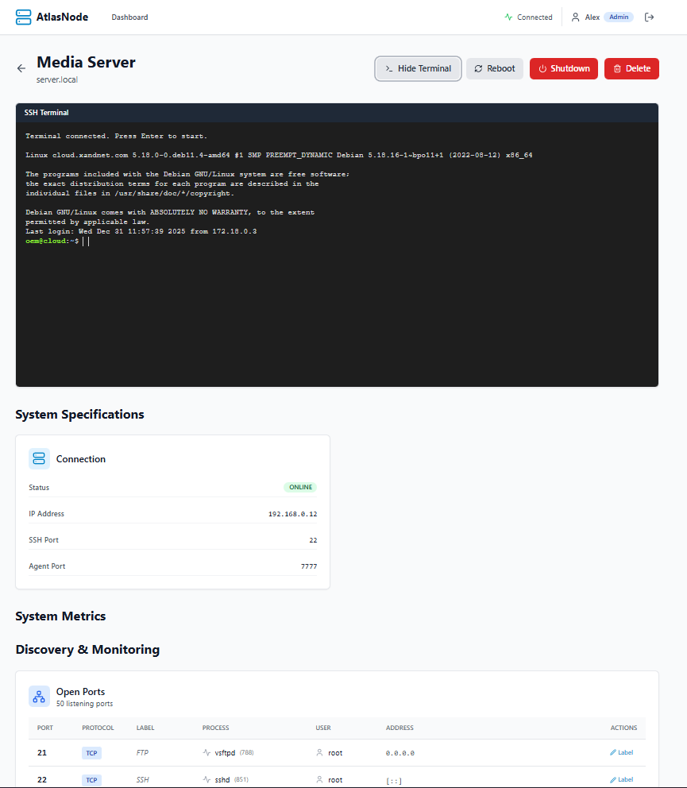
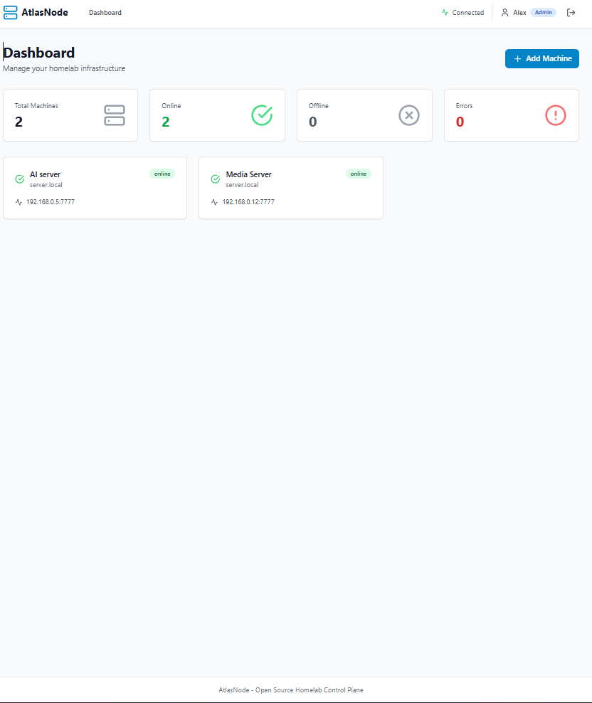

# AtlasNode - Open-Source Homelab Control Plane


AtlasNode is a powerful, open-source homelab management platform that allows you to centrally monitor, control, and manage multiple servers from a single web dashboard.

## Screenshots

### Dashboard Overview

*Real-time monitoring of all your machines with live metrics and status*

### Machine Details & Terminal

*Detailed system information and web-based SSH terminal access*

### System Monitoring & Discovery

*Track screen sessions, open ports, and system specifications*

## Features

- **Zero-Touch Agent Installation**: Add machines via SSH credentials - agent installs automatically
- **Real-Time Monitoring**: Live system metrics (CPU, memory, disk, network)
- **Remote Control**: Execute commands, reboot, shutdown from the dashboard
- **Web-Based SSH Terminal**: Access your machines directly from the browser
- **Role-Based Access Control**: Admin and viewer roles
- **WebSocket Live Updates**: Real-time status changes and metrics
- **Audit Logging**: Track all actions and changes
- **Docker-First Architecture**: Easy deployment with Docker Compose
- **Secure by Default**: Encrypted credentials, JWT authentication, token-based agent auth

## Quick Start

### Prerequisites

- Docker and Docker Compose installed
- Linux, macOS, or Windows with WSL2

### Installation

1. Clone the repository:
```bash
git clone https://github.com/Aletech-Solutions/Open-Atlas-Node.git
cd atlasnode
```

2. Run the setup script:
```bash
chmod +x scripts/setup.sh
./scripts/setup.sh
```

3. Access the dashboard at `http://localhost:3000`

4. Register your first user (automatically becomes admin)

5. Add your first machine via the "Add Machine" button

## Architecture

AtlasNode consists of three main components:

### Control Server (Backend + Frontend)
- **Backend**: Express.js REST API with WebSocket support
- **Frontend**: React.js dashboard with real-time updates
- **Database**: PostgreSQL for persistent storage

### Agent API
- Lightweight Node.js service installed on each managed machine
- Collects system metrics using `systeminformation`
- Exposes REST endpoints for remote control
- Sends heartbeat to control server

### Auto-Installer
- SSH-based zero-touch installation
- Detects OS and architecture
- Installs dependencies and configures agent
- Sets up systemd service for auto-start

## Technology Stack

**Backend:**
- Express.js
- PostgreSQL
- WebSocket (ws)
- SSH2 (for agent installation)
- JWT authentication
- bcrypt password hashing

**Frontend:**
- React 18
- Vite
- TailwindCSS
- Recharts (metrics visualization)
- XTerm.js (web terminal)
- Axios

**Agent:**
- Node.js
- Express
- systeminformation

**Infrastructure:**
- Docker & Docker Compose
- Nginx (production)

## Configuration

Configuration is done via environment variables in the `.env` file:

```env
# Database
DB_NAME=atlasnode
DB_USER=atlasnode
DB_PASSWORD=secure_password_here

# Backend
JWT_SECRET=your_long_random_secret
JWT_EXPIRES_IN=7d

# Ports
BACKEND_PORT=5000
FRONTEND_PORT=3000
```

## API Documentation

### Authentication
- `POST /api/auth/register` - Register new user
- `POST /api/auth/login` - Login
- `GET /api/auth/me` - Get current user

### Machines
- `GET /api/machines` - List all machines
- `GET /api/machines/:id` - Get machine details
- `POST /api/machines` - Add new machine (admin only)
- `DELETE /api/machines/:id` - Remove machine (admin only)
- `POST /api/machines/:id/action` - Execute action on machine
- `GET /api/machines/:id/metrics` - Get historical metrics

### Terminal
- `POST /api/terminal/create/:machineId` - Create SSH session
- `POST /api/terminal/write/:sessionId` - Send data to terminal
- `GET /api/terminal/read/:sessionId` - Read terminal output (SSE)
- `DELETE /api/terminal/:sessionId` - Close terminal session

## Security Best Practices

1. **Change Default Credentials**: Update all passwords in `.env`
2. **Use Strong JWT Secret**: Generate with `openssl rand -hex 32`
3. **HTTPS in Production**: Use reverse proxy (Nginx, Caddy)
4. **Firewall Rules**: Restrict agent ports (7777) to control server only
5. **SSH Key Authentication**: Prefer SSH keys over passwords
6. **Regular Updates**: Keep dependencies and OS updated
7. **Audit Logs**: Monitor audit logs regularly

## Backup & Restore

### Backup
```bash
./scripts/backup.sh
```

### Restore
```bash
gunzip < backups/atlasnode_backup_TIMESTAMP.sql.gz | \
  docker-compose exec -T database psql -U atlasnode atlasnode
```

## Updating

```bash
./scripts/update.sh
```

## Development

### Running Locally (Development Mode)

**Backend:**
```bash
cd backend
npm install
npm run dev
```

**Frontend:**
```bash
cd frontend
npm install
npm run dev
```

**Agent:**
```bash
cd agent
npm install
cp config.example.json config.json
# Edit config.json with your settings
npm start
```

### Manual Agent Installation (with Auto-Start)

For manual agent installation with automatic restart on system reboot:

**Linux:**
```bash
cd agent
cp config.example.json config.json
# Edit config.json with your settings
chmod +x install.sh
sudo ./install.sh
```

**Windows:**
```cmd
cd agent
copy config.example.json config.json
REM Edit config.json with your settings
install.bat
```

See [agent/README-INSTALLATION.md](agent/README-INSTALLATION.md) for detailed installation instructions.

The agent will:
- ✓ Start automatically on system boot
- ✓ Restart automatically if it crashes
- ✓ Wait for network availability before starting
- ✓ Log to system journal (Linux) or Event Viewer (Windows)

## Troubleshooting

### Agent Installation Fails
- Check SSH credentials
- Verify network connectivity
- Ensure target machine has sudo access
- Check backend logs: `docker-compose logs backend`

### Machine Shows Offline
- Verify agent is running: `systemctl status atlasnode-agent`
- Check firewall rules
- Verify agent token in `/opt/atlasnode-agent/config.json`
- Check agent logs: `journalctl -u atlasnode-agent -f`
- Ensure agent is enabled to start on boot: `systemctl is-enabled atlasnode-agent`

### WebSocket Not Connecting
- Check browser console for errors
- Verify CORS settings in backend
- Check WebSocket URL configuration

## Contributing

Contributions are welcome! Please feel free to submit a Pull Request.

1. Fork the repository
2. Create your feature branch (`git checkout -b feature/AmazingFeature`)
3. Commit your changes (`git commit -m 'Add some AmazingFeature'`)
4. Push to the branch (`git push origin feature/AmazingFeature`)
5. Open a Pull Request

## License

This project is licensed under the MIT License - see the [LICENSE](LICENSE) file for details.

## Support

- GitHub Issues: [Report bugs or request features](https://github.com/Aletech-Solutions/Open-Atlas-Node/issues)
- Documentation: [Full documentation](https://github.com/Aletech-Solutions/Open-Atlas-Node/wiki)

## Roadmap

- [ ] Docker container monitoring
- [ ] Proxmox integration
- [ ] Alert system (email, webhook)
- [ ] Mobile app
- [ ] Plugin system
- [ ] Multi-user workspaces
- [ ] Ansible playbook execution
- [ ] Network topology visualization

---

Made with ❤️


